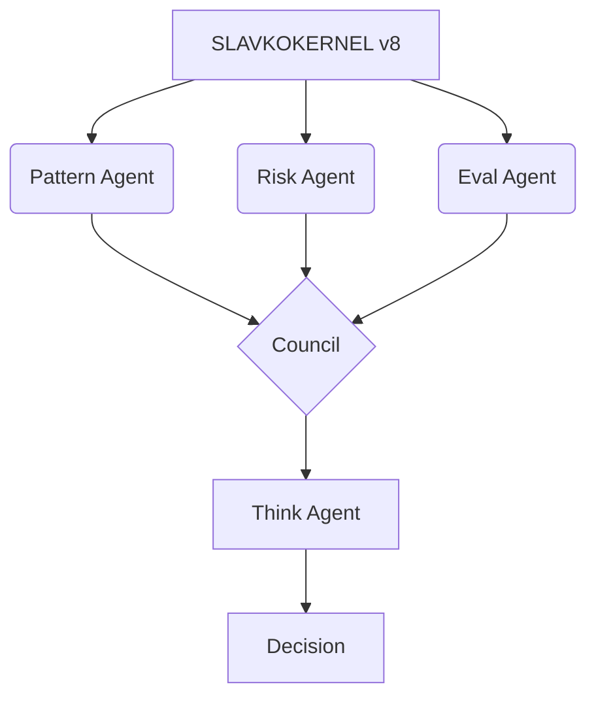

# 🧠 SlavkoKernel v8

<p align="center">
  
</p>

<p align="center">
  <strong>Presentation & Governance Layer</strong><br/>
  <em>Multi-Agent Orchestration Kernel with Council Governance</em>
</p>

<p align="center">
  <a href="https://github.com/theOrchestrationAI/slavko-kernel/releases"></a>
  <a href="https://ollama.com/mladen-gertner/slavkokernel-v8"></a>
  <a href="LICENSE"></a>
</p>

<p align="center">
  
  
</p>

---

## 🎯 Overview

**SlavkoKernel v8** is the governance and presentation layer of the S.L.A.V.K.O.™ orchestration system. It coordinates Pattern, Risk, Eval, and Think agents through a council-based voting mechanism, producing dual-layer outputs in Markdown and JSON.

---

## 🚀 Quick Start

```bash
# Run with Ollama
ollama run mladen-gertner/slavkokernel-v8

# API Call
curl -X POST http://localhost:11434/api/generate \
  -H "Content-Type: application/json" \
  -d '{
    "model": "mladen-gertner/slavkokernel-v8",
    "prompt": "Orchestrate council vote: Analyze Q4 performance"
  }'
```

---

## 🏗️ Architecture



---

## 📊 Council Governance

| Parameter      | Value | Description              |
| :------------- | :---- | :----------------------- |
| **Quorum**     | 3/4   | Minimum agents required  |
| **Threshold**  | 66%   | Agreement for approval   |
| **Timeout**    | 30s   | Max decision time        |
| **Escalation** | Auto  | Conflicts → Human review |

---

## 📤 Output Format

```json
{
  "council_decision": {
    "verdict": "approved|rejected|needs_review",
    "confidence": 0.0-1.0,
    "quorum_met": true,
    "votes": {}
  },
  "synthesis": "...",
  "recommendations": [],
  "audit": {
    "kernel_version": "8.0",
    "timestamp_utc": "ISO8601",
    "decision_hash": "sha256:..."
  }
}
```

---

## 📞 Contact

**Mladen Gertner** — FormatDisc™, Zagreb, Croatia  
📧 mladen@formatdisc.hr | 🌐 [formatdisc.hr](https://formatdisc.hr)

---

<p align="center">
  <sub>© 2026 FormatDisc™, vl. Mladen Gertner — All Rights Reserved</sub>
</p>
